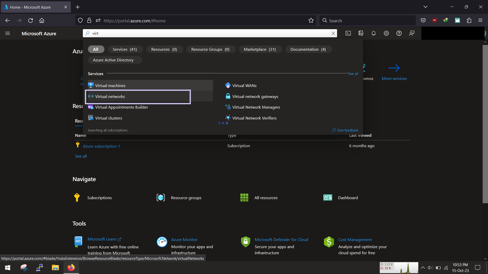
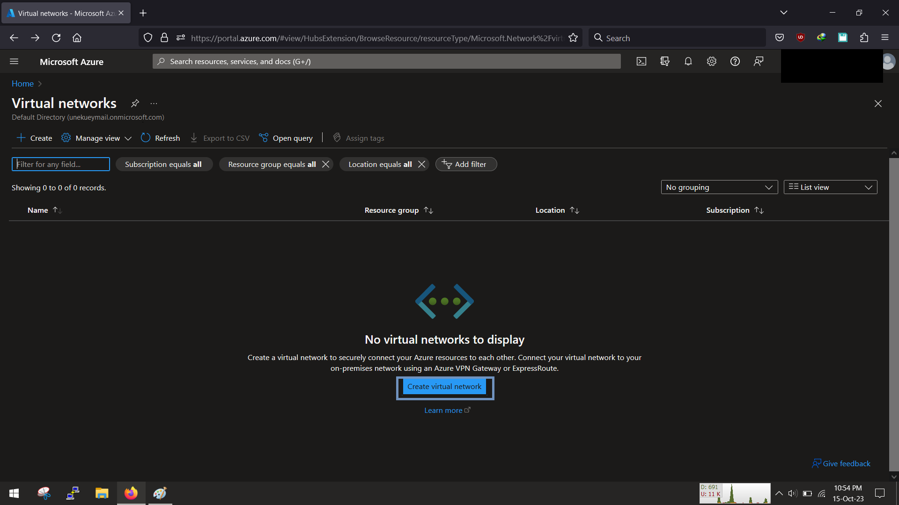
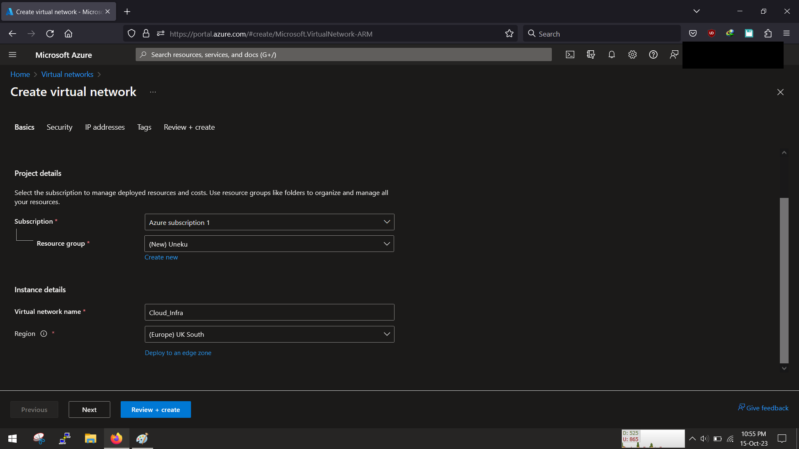
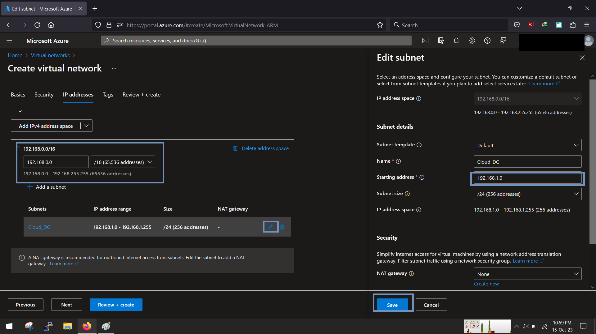
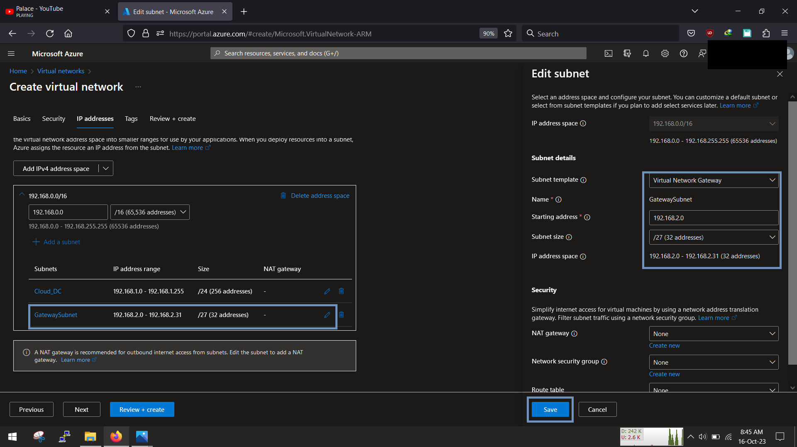
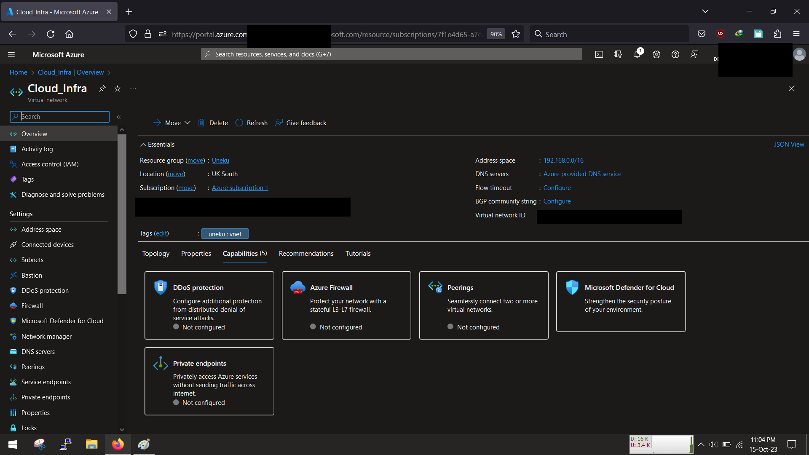

<!-- @format -->

# Azure Point-to-Site Setup

Setting up Azure point to site is little bit tricky but stick along, here are the steps to follow

1. Setup a virtual network
1. Spin up your virtual machine
1. Setup A virtual network gateway

So lets get to it!

## A. Setup a Vnet

Login in to your console and search for virtual network

then create new virtual network

while we begin our creation of vnet, we create our resource group and give our vnet a name of "cloud_infra" and set our region to uk south, since thats closer to me😁

we can skip the security tab as we are not creating firewalls,bastions and ddos protections yet!

Click next and then let us work on setting up the CIDR block for the vnet

We will be using the network space of 192.168.0.0/16, this will give us alot of space to use, also select "add a subnet" and our 1st subnet is going to be 192.168.1.0/24(256 ip addresses)

Click on add subnet again, this time around on the panel that slides in on the left, select the virtual network gateway template, using the 192.168.2.0/27 range (remember its needs to be about /27 or greater)

Once done you can create "review + create", wait for validation and creation

great we have a vnet, now we can create our vm
